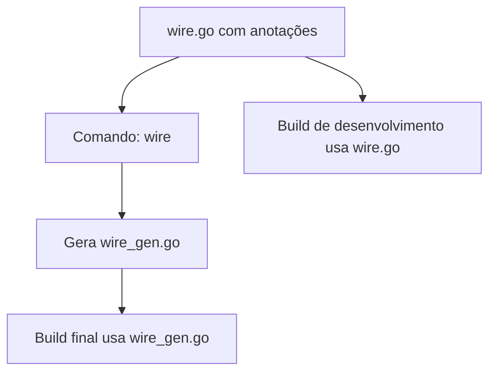
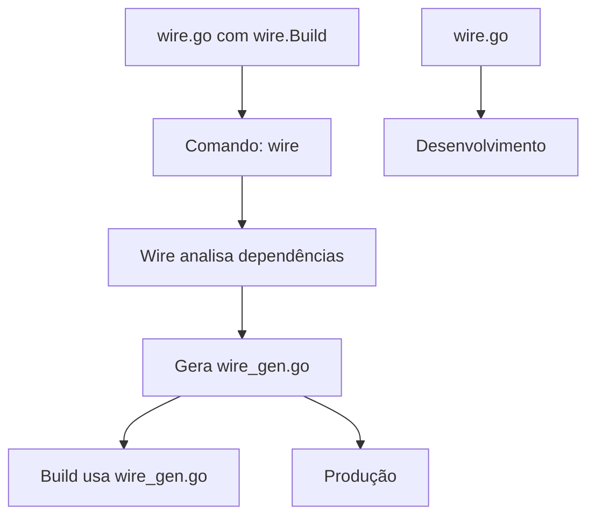

# 📦 Dependency Injection com Wire

> Exemplo prático de Dependency Injection em Go usando a biblioteca Wire do Google

## 📌 Sobre

Este projeto demonstra como implementar **Dependency Injection (DI)** em Go usando a biblioteca **Wire**, uma ferramenta de código gerado que resolve dependências automaticamente em tempo de compilação.

## 🔧 O que é Dependency Injection

**Dependency Injection** é um padrão de design que permite que objetos recebam suas dependências de fontes externas, em vez de criá-las internamente. Isso torna o código mais:

- ✅ **Testável**: Fácil de mockar dependências
- ✅ **Flexível**: Fácil de trocar implementações
- ✅ **Manutenível**: Baixo acoplamento entre componentes
- ✅ **Reutilizável**: Componentes independentes

### Exemplo sem DI (❌ Ruim)

```go
func main() {
    db, _ := sql.Open("sqlite3", "./test.db")
    repository := product.NewProductRepository(db)
    usecase := product.NewProductUseCase(repository)
    // Lógica de negócio misturada com inicialização
}
```

### Exemplo com DI (✅ Bom)

```go
func main() {
    usecase, err := InitializeProductUseCase()
    if err != nil {
        panic(err)
    }
    // Lógica de negócio separada da inicialização
}
```

## 🛠️ Instalação

### 1. Instalar a biblioteca Wire

```bash
go get github.com/google/wire
```

### 2. Instalar o comando wire

```bash
go install github.com/google/wire/cmd/wire@latest
```

### 3. Executar o projeto

```bash
go run .
```

## 🏗️ Como funciona o Wire

### 1. **Providers** (Funções que criam instâncias)

```go
// Provider para o banco de dados
func NewDB() (*sql.DB, error) {
    return sql.Open("sqlite3", "./test.db")
}

// Provider para o repositório
func NewProductRepository(db *sql.DB) *product.ProductRepository {
    return product.NewProductRepository(db)
}

// Provider para o usecase
func NewProductUseCase(repo *product.ProductRepository) *product.ProductUseCase {
    return product.NewProductUseCase(repo)
}
```

### 2. **Wire Set** (Agrupa os providers)

```go
var setRepositoryDependency = wire.NewSet(
    product.NewProductRepository,
    wire.Bind(new(product.ProductRepositoryInterface), new(*product.ProductRepository)),
)
```

### 3. **Função de Inicialização** (Gerada automaticamente)

```go
func NewUseCase(db *sql.DB) *product.ProductUseCase {
    wire.Build(
        setRepositoryDependency,
        product.NewProductUseCase,
    )
    return &product.ProductUseCase{}
}
```

### 4. **wire.Bind** (Conecta interfaces com implementações)

```go
wire.Bind(new(product.ProductRepositoryInterface), new(*product.ProductRepository))
```

**Por que é necessário?**

- O `NewProductUseCase` espera `ProductRepositoryInterface` (interface)
- O `NewProductRepository` retorna `*ProductRepository` (struct concreta)
- O `wire.Bind` conecta a interface com sua implementação

## 📝 Anotações Importantes

### `//go:build wireinject` e `// +build wireinject`

Essas anotações são **cruciais** para o funcionamento do Wire:

```go
//go:build wireinject
// +build wireinject

package main
```

**Por que são importantes?**

1. **Separação de Build Tags**
   - O arquivo `wire.go` só é compilado quando a tag `wireinject` está ativa
   - O arquivo `wire_gen.go` (gerado) só é compilado quando a tag `wireinject` NÃO está ativa

2. **Evita Conflitos**
   - O Wire gera código que substitui a função `InitializeProductUseCase`
   - As anotações garantem que apenas uma versão seja compilada por vez

3. **Build Condicional**
   - Durante desenvolvimento: usa `wire.go` (com `wire.Build`)
   - Após gerar código: usa `wire_gen.go` (código real)

### Fluxo de Compilação



## 🚀 Comandos Úteis

### Gerar código do Wire

```bash
wire
```

### Gerar e executar

```bash
wire && go run .
```

### Verificar dependências

```bash
go mod tidy
```

## ⚙️ Como o comando `wire` funciona

### Processo de Geração

1. **Leitura do `wire.go`**: O Wire analisa o arquivo com as anotações `//go:build wireinject`
2. **Análise de Dependências**: Identifica a cadeia de dependências entre as funções
3. **Geração do Código**: Cria o arquivo `wire_gen.go` com código Go real

### Exemplo Prático

**Arquivo `wire.go` (desenvolvimento):**

```go
//go:build wireinject
// +build wireinject

var setRepositoryDependency = wire.NewSet(
    product.NewProductRepository,
    wire.Bind(new(product.ProductRepositoryInterface), new(*product.ProductRepository)),
)

func NewUseCase(db *sql.DB) *product.ProductUseCase {
    wire.Build(
        setRepositoryDependency,
        product.NewProductUseCase,
    )
    return &product.ProductUseCase{} // Placeholder
}
```

**Arquivo `wire_gen.go` (gerado automaticamente):**

```go
//go:build !wireinject
// +build !wireinject

func NewUseCase(db *sql.DB) *product.ProductUseCase {
    productRepository := product.NewProductRepository(db)
    productUseCase := product.NewProductUseCase(productRepository)
    return productUseCase // Código real!
}
```

### Anotações de Build

- **`wire.go`**: `//go:build wireinject` - Usado durante desenvolvimento
- **`wire_gen.go`**: `//go:build !wireinject` - Usado em produção
- **Evita conflitos**: Apenas um arquivo é compilado por vez

### Fluxo de Geração de Código



### Vantagens do Código Gerado

- ✅ **Código Limpo**: Elimina `wire.Build` e placeholders
- ✅ **Dependências Resolvidas**: Cria cadeia correta de inicialização
- ✅ **Type Safety**: Mantém todos os tipos corretos
- ✅ **Performance**: Código otimizado sem overhead

## 🔧 Problemas Comuns e Soluções

### Erro: "no provider found for interface"

**Problema:**

```text
wire: no provider found for ProductRepositoryInterface
```

**Causa:** O Wire não consegue conectar uma interface com sua implementação.

**Solução:** Use `wire.Bind` para conectar interface e implementação:

```go
var setRepositoryDependency = wire.NewSet(
    product.NewProductRepository,
    wire.Bind(new(product.ProductRepositoryInterface), new(*product.ProductRepository)),
)
```

### Erro: "inject function must have exactly one return value"

**Problema:** Função de injeção com múltiplos retornos.

**Solução:** Use apenas um retorno na função de injeção:

```go
// ❌ Ruim
func NewUseCase(db *sql.DB) (*product.ProductUseCase, error) {
    // ...
}

// ✅ Bom
func NewUseCase(db *sql.DB) *product.ProductUseCase {
    // ...
}
```

## 📁 Estrutura do Projeto

```text
19_DI/
├── README.md              # Este arquivo
├── go.mod                 # Dependências do Go
├── go.sum                 # Checksums das dependências
├── main.go               # Ponto de entrada da aplicação
├── wire.go               # Configuração do Wire (desenvolvimento)
├── wire_gen.go           # Código gerado pelo Wire (produção)
└── product/              # Pacote de domínio
    ├── entity.go         # Entidades do domínio
    ├── repository.go     # Interface e implementação do repositório
    └── usecase.go        # Casos de uso (regras de negócio)
```

## 🧪 Vantagens do Wire

### 1. **Compile-time Safety**

- Erros de dependência detectados durante a compilação
- Não há overhead em runtime
- Validação de tipos automática

### 2. **Código Limpo**

- Elimina boilerplate de DI
- Separação clara de responsabilidades
- Fácil de manter e entender

### 3. **Testabilidade**

- Fácil mock de dependências
- Testes unitários mais simples
- Isolamento de componentes

### 4. **Flexibilidade**

- Fácil troca de implementações
- Configuração por ambiente
- Injeção condicional

## 🔍 Exemplo de Uso

### Antes (Manual)

```go
func main() {
    db, err := sql.Open("sqlite3", "./test.db")
    if err != nil {
        panic(err)
    }
    
    repository := product.NewProductRepository(db)
    usecase := product.NewProductUseCase(repository)
    
    product, err := usecase.GetProduct(1)
    if err != nil {
        panic(err)
    }
    
    fmt.Println(product.Name)
}
```

### Depois (Com Wire)

```go
func main() {
    usecase, err := InitializeProductUseCase()
    if err != nil {
        panic(err)
    }
    
    product, err := usecase.GetProduct(1)
    if err != nil {
        panic(err)
    }
    
    fmt.Println(product.Name)
}
```

## 📚 Recursos Adicionais

- [Documentação oficial do Wire](https://github.com/google/wire)
- [Go Dependency Injection Patterns](https://blog.golang.org/dependency-injection)
- [Clean Architecture em Go](https://blog.cleancoder.com/uncle-bob/2012/08/13/the-clean-architecture.html)

## 🤝 Contribuição

1. Fork o projeto
2. Crie uma branch para sua feature
3. Commit suas mudanças
4. Push para a branch
5. Abra um Pull Request

## 📄 Licença

Este projeto está sob a licença MIT. Veja o arquivo [LICENSE](LICENSE) para mais detalhes.
